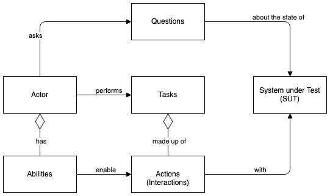

[Back to overview](../../README.md)

# Screenplay Pattern Overview

The Screenplay Pattern is a user-centered approach for writing high-quality automated tests. It guides you to effective use of abstraction levels, helps you align tests with business language, and promotes good testing and software development practices.

Instead of focusing on low-level, interface-oriented interactions, you describe your test scenarios in a similar way to how you would explain them to a human - an actor in a screenplay sense. You write simple, readable and highly reusable code that instructs actors what activities to perform and what things to check. The domain-specific test language you create is used to express scripts - the activities you want the actors to perform in a particular test scenario.

Testla's implementation of the Screenplay Pattern enables developers to easily introduce this design approach even into existing test automation projects.

## The design principle

The design principle behind the Screenplay Pattern is simple but might change the way you look at test automation:
> [!IMPORTANT]
> Automated acceptance tests should use your domain language to clearly express what activities the actors interacting with your system need to perform in order to accomplish their goals.

Applying this design principle to your automated tests has a number of positive implications:
- Expressing your test scenarios in your domain language makes them easier to understand and accessible to a wider audience
- Focusing on actors and their goals makes it easy to correlate any test failures with the actual business impact
- Modelling actor workflows using sequences of business-focused, reusable activities reduces code duplication, improves flexibility of your test code base, and means that your team can quickly compose new test scenarios from existing steps

## The 5 elements of the Screenplay Pattern

The Screenplay Pattern is beautiful in its simplicity. It's made up of five elements, five types of building blocks that Testla gives you to design any functional acceptance test you need, no matter how sophisticated or how simple.

The key 5 key elements of the pattern are: 
- **Actors**, who represent people interacting with the system under test (SUT)
- **Abilities**, that act as thin wrapper around a client of a specific interface to interact with the system under test
- **Tasks**, used to model sequences of actions as meaningful steps of a business workflow in your domain
- **Actions**, which represents the low-level activities an actor can perform
- **Questions**, used to retrieve information from the SUT and the test execution environment



### Actors and Abilities

The Screenplay Pattern is a user-centric model with users and external systems interacting with the system under test represented as actors. `Actors` are a key element of the pattern as they are the ones performing the test scenarios.

Actors need `abilities` to enable them interacting with any interface of the system. How does it know how to connect your actors to those interfaces? Well, it doesn't unless you tell it, and that's where abilities come into play.

#### Defining an Actor with an Ability

For example, Ute will interact with the REST API using the Playwright HTTP client. At the same time, Andy will interact with the Web UI using Playwright's page object. 

```typescript
const Ute = Actor.named('Ute').can(UseAPI.using(request));
const Andy = Actor.named('Andy').can(BrowseTheWeb.using(page)).with('page', page);
```

### Tasks

`Tasks` model sequences of activities and help you capture meaningful steps of an actor workflow in your domain. Typically, tasks correspond to higher-level, business domain-specific activities like to `SignUp`, `PlaceATrade`, `TransferFunds`, and so on. 
Tasks are the core building block of the Screenplay Pattern, along with Actors, Abilities, Actions, and Questions.
To make an actor perform a task, you pass it to the attemptsTo(..) method.

```typescript
await Andy.attemptsTo(Login.toApp());
```

### Actions

`Abilities` enable actors to perform `actions` with the system under test. `Actions` are command objects that instruct an actor how to use their abilities to perform the given activity. Most interactions you will need are already provided by testla, and you can easily create new ones if you'd like to.

Here, we instruct Ute to use the action to send a post request with data to an endpoint:

```typescript
const data = {
    title: 'foo',
    body: 'bar',
    userId: 1,
}

await Ute.attemptsTo(Post.to('https://jsonplaceholder.typicode.com/posts').withData(data));
```
We can also instruct Andy to use actions to navigate to the web interface of our system under test:

```typescript
await Andy.attemptsTo(Navigate.to('https://google.de'));
```

### Questions

Apart from enabling interactions, abilities also enable actors to answer questions about the state of the system under test. 
For example, we could instruct Ute to ask the question about the last response status. 

```typescript
await Ute.asks(Response.has.statusCode(response, 200));
```

Even though Andy uses a web browser and not an API client, the way we instruct him to answer web questions and perform web assertions is consistent with how you'd interact with any other interface:

```typescript
await Andy.asks(Element.toBe.visible(HomeScreen.LOGGED_IN_INDICATOR));
```

Even though these are the fundamental components of the Screenplay Pattern, the true power lies in how you combine and orchestrate them to create expressive, maintainable, and robust automated tests that align with your business domain. Embrace the Screenplay Pattern, and elevate your test automation to a level where tests not only validate functionality but also tell a clear and compelling story of your application's behavior.

[Back to overview](../../README.md)